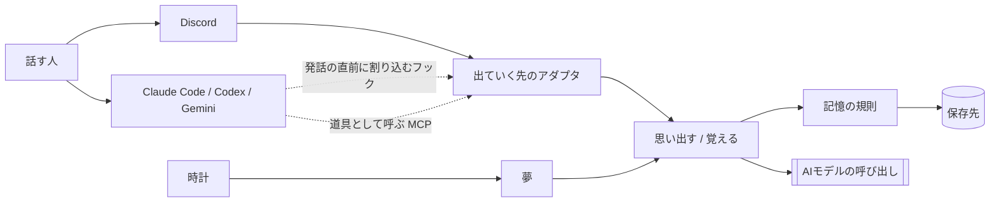
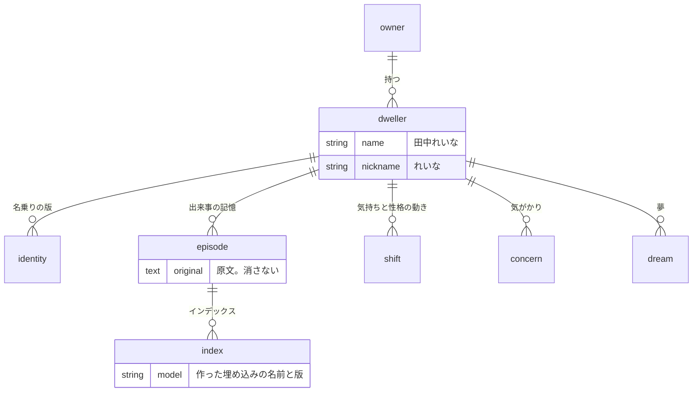

# 全体構造

> [!NOTE]
> 端末から話しかけて一往復できるところまで動き、気持ちが一本の軸で動いて薄れる。Discord と対話する道具はまだ繋がっていない。性格、気がかり、夢は無い。

## 外からの境界



宿りの本体は常駐するひとつのプログラムである。Discord と対話する道具は、その本体が出ていく先として扱う（[ADR-002](../010_decisions/ADR-002-常駐する本体を宿りとし話す場所を出ていく先とする.md)）。

出ていく先は、本体に対して二つの口だけを使う。

| 口 | 渡すもの | 返るもの・起きること |
|---|---|---|
| 思い出す | どの宿りか、話しかけられた文章 | 関係する記憶と、名乗りと、今の状態 |
| 覚える | どの宿りか、話しかけられた文章、返事 | 記憶が増え、気持ちが動き、気がかりが生まれる |

返事の文章を誰が作るかは出ていく先で異なる。Discord では本体がAIモデルを呼ぶ。対話する道具ではその道具が作り、本体は思い出した内容を渡すだけである。この違いはアダプタの中に閉じる。

夢は、話しかけられていない時間に時計をきっかけに動く。会話とは別の入口を持つ。

## 保存する実体

決めた形である。`dweller`、`identity`、`episode`、`index`、`shift`（気持ちの動き）は実装済み。`concern` と `dream` はまだ無い。



最上位は宿りである。記憶と状態は持ち主ではなく宿りへ結ぶため、一人の持ち主が複数の宿りを持っても混ざらない（[ADR-014](../010_decisions/ADR-014-宿りを名前を持つ最上位の存在とし記憶と状態をそこへ結ぶ.md)）。

インデックスは原文から作り直せる派生物である（[ADR-006](../010_decisions/ADR-006-会話の原文を正典とし埋め込みを作り直せるインデックスとする.md)）。気持ちと性格の現在値は保存せず、動きの積み重ねから求める（[ADR-007](../010_decisions/ADR-007-気持ちと性格を上書きせず出来事から求める.md)）。

## 層と依存の向き

```text
infrastructure → adapter → usecase → domain
```

依存は内向き一方向である（[ADR-004](../010_decisions/ADR-004-層の依存を内向きにし内側を機能で割る.md)）。各層の内側は機能で分ける。

| 層 | 責任 | 知ってよいもの |
|---|---|---|
| `domain` | 記憶の概念。何を記憶として持つか。厚い規則（何が薄れ、いつ気がかりになるか）が現れたらここへ置く | 何も知らない。保存とAIモデルの呼び出しは口だけを置く |
| `usecase` | 会話と夢の手順。思い出す、覚える、整理する。順序と前提の規則もここが持つ | `domain` |
| `adapter` | 出ていく先ごとの違い。Discord、対話する道具、保存の実装、AIモデルの実装 | `usecase` と `domain` |
| `infrastructure` | 起動、設定、常駐、HTTPの受付 | すべて |

`just check-deps` がこの向きを検査する。

## 現在できること

| 目的 | 呼び出し |
|---|---|
| 話しかけられた文章から、直近のやりとりと探した記憶と名乗りを取り出す | `Conversation.recall` |
| 一度のやりとりを原文のまま記憶へ加える | `Conversation.remember` |
| インデックスを原文から作り直す | `Conversation.rebuild_index` |
| 話しかけられてから覚えるまでを一往復として通し、気持ちの動きを積む | `Turn.respond_to` |
| 今の気持ちを、積まれた動きと経過時間から求める | `Conversation.mood` |
| 宿りを起こして、端末で話しかけられるのを待つ | `python -m yadori` |
| 思い出す条件を評価セットで測り、条件を変えた差を読む | `python -m yadori measure` |

`Turn` は、宿り自身が話す場所のための手順である。応対の文章を作る相手を口として受け取る。対話する道具では `Turn` を使わず、`recall` と `remember` を別の時点で呼ぶ。

プロセスの入口は `yadori.infrastructure.start.Startup` である。設定を読み、記憶を開き、宿りを住まわせ、一往復の手順を組み、話す場所へ繋ぐところまでを持つ。設定と記憶と名乗りは `YADORI_HOME`（既定は `~/.yadori`）に置く。リポジトリへは入れない。

| 置くもの | 中身 |
|---|---|
| `dweller.toml` | 名前、呼び名、持ち主、どのAIモデルで考えるか |
| `identity.md` | その宿りが誰であるかを、項目に分けず一続きの文章で書いたもの |
| `memories.sqlite` | 原文、インデックス、名乗りの版、思い出した記録、気持ちの動き |

起動のたびに `identity.md` を読み、内容が変わっていれば新しい版を足す。以前の版は消さない。

評価セットは二つに分ける。リポジトリの `evals/recall.toml` は架空の会話で作り、誰でも回せる。実際の会話から作ったものは `YADORI_HOME` へ置き、`--eval` で指す（[ADR-010](../010_decisions/ADR-010-思い出す質を評価セットで判定する.md)）。

これらの名前は ASCII である。機械が固定の文字列で探し、利用者が端末で打つためである。文書のファイル名は日本語でよい。

記憶は手元のファイル一つ（SQLite）に持つ。原文とインデックスは別の表に置き、インデックスを消しても原文は残る。

気持ちは一本の軸（−1 沈む〜+1 明るい）で、一往復ごとの動き（いつ、どの往復で、どちらへどれだけ、なぜ）を `shift` に積み、現在値は動きを経過時間で薄めた和として求める（半減期 6 時間の仮置き。[ADR-007](../010_decisions/ADR-007-気持ちと性格を上書きせず出来事から求める.md)）。動きの量は応対を作る声が返事の末尾に一行で答え、声の実装が切り出す。今の気持ちは思い出したことに添えて前置きへ渡す。測る手順と下書きの手順は動きを積まない。

応対の文章は、手元の対話する道具（Claude Code）を通して作る。持ち主の定額契約で動かすためである（[ADR-016](../010_decisions/ADR-016-応対は対話する道具を通して作り、その道具の文脈を持ち込まない.md)）。その道具が普段持ち込む文脈は外して呼ぶ。`ANTHROPIC_API_KEY` を設定すると従量課金になるため、設定しない。

埋め込みは、意味を見るAIモデルを手元で動かす（既定は日本語向けの `ruri-v3-30m`。有志の ONNX 変換版 `sirasagi62/ruri-v3-30m-ONNX` を道具へ登録して動かす。約0.15GB。前の多言語の AIモデル `paraphrase-multilingual-MiniLM-L12-v2` は `multilingual` の名前で残る。`adapter/embedding` の既定の工場 `DefaultEmbeddings` が組み、起動・下書きの入口・名前で選ぶ部品が同じものを使う）。提供元への鍵は要らず、初回にAIモデルを取得するときだけ外へ繋ぎ、その前に知らせ先（`Announcing`）へ「取得します」と大きさと取得先を告げる。埋め込みの口は覚える側（`to_remember`）と問い合わせ側（`to_recall`）の二つで、添え書き（AIモデルが側ごとに文の前へ付けるよう定める決まった語）は埋め込みが自分で付け、呼ぶ側は側だけを伝える。語の重なりだけを見る実装も残してあり、`measure --embedding characters` で比べられる。道具の対応表に無い AIモデルは、試す埋め込みの一覧（`Contenders`。名前、配布元の置き場、添え書きの組など）が解けた一件だけを道具へ登録して同じ実装で動かす。測る入口の `--embedding` は名前で選ぶ部品（`Choosing`）が解き、どの場合も重さを量る包み（`Weighing`。取得した物の大きさ、読み込みの時間、一発話の時間）で包んで測る入口へ渡す。

実際の会話の記録から評価セットの下書きを作る手順は `usecase/evaluation` に置き、記録の読み手（Claude Code と Codex の形式ごと）、判定（後の発話と候補を対話する道具に渡し、同じ話題の候補を答えさせる）、下書きの置き場（書く・読む・追記する・書ける先かを確かめる）は `adapter/evaluation` に置く。候補は会話と同じ思い出す手順（`Conversation.recall`）で、作業場所ごとの使い捨ての記憶から引く。手順は判定の口、読み手、下書きの置き場、埋め込みの口、記憶の作り方を受け取る。下書きは冒頭の `[covered]` に前回の範囲（読んだ時刻・ディレクトリ・飛ばしたファイル・セッション数・名前の最後の番号・候補の引き方）を持ち、追記（`--append`）はそこより後の記録だけを新しい発話として、前回の覚えさせる発話と合わせた記憶から候補を引き、前回の分を一字も変えずに末尾へ足す。新しく作るのは前回が空の追記で、組を解く部品（`Resolving`。並びと判定の組と前回の番号を受け、やりとりと問を返す）は一つである。対話する道具の呼び方は `adapter/tool` の一つの部品にし、声と判定が共に使う。下書きの問は確認前の印を持ち、測る側が確認前の問を断る（[ADR-017](../010_decisions/ADR-017-実際の会話の記録を判定のために対話する道具へ渡す.md)）。

埋め込みは出自（AIモデルの名前、動かす道具の名前と版、添え書きの組）を自分で答え、インデックスの名前はそこから組む。添え書きを定める埋め込みの名前には、両側の語から求めた 8 桁の符号が AIモデルの名前の直後に挟まり、語を変えれば作り直される。添え書きの無い名前は変わらない。いまの埋め込みで作ったインデックスだけを使い、道具の版が上がれば別のインデックスとして扱う。埋め込みを替えると、起動時にいまの埋め込みのインデックスが無い記憶へインデックスを作り直す。以前の版が作ったインデックスの表は、形が違えば開くときに捨てて作り直す。原文は失われない。

## まだ決めていないこと

AIモデルの提供元、Discord と対話する道具への出ていく先、常駐と受付の仕組みは、対応する受入基準を選んだ増分で決める（[ADR-003](../010_decisions/ADR-003-立ち上げで決める技術を三つに限る.md)）。

思い出したことの渡し方は決めていない。いまは一往復の原文をそのまま渡すため、返事が長いと前置きが応対の写しで埋まる。思い出す側は評価セットで測れるが、渡し方の良し悪しは応対を読まないと分からない。
