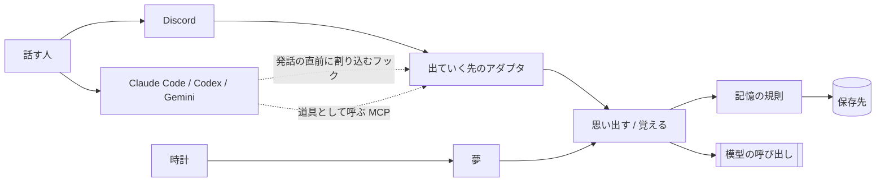
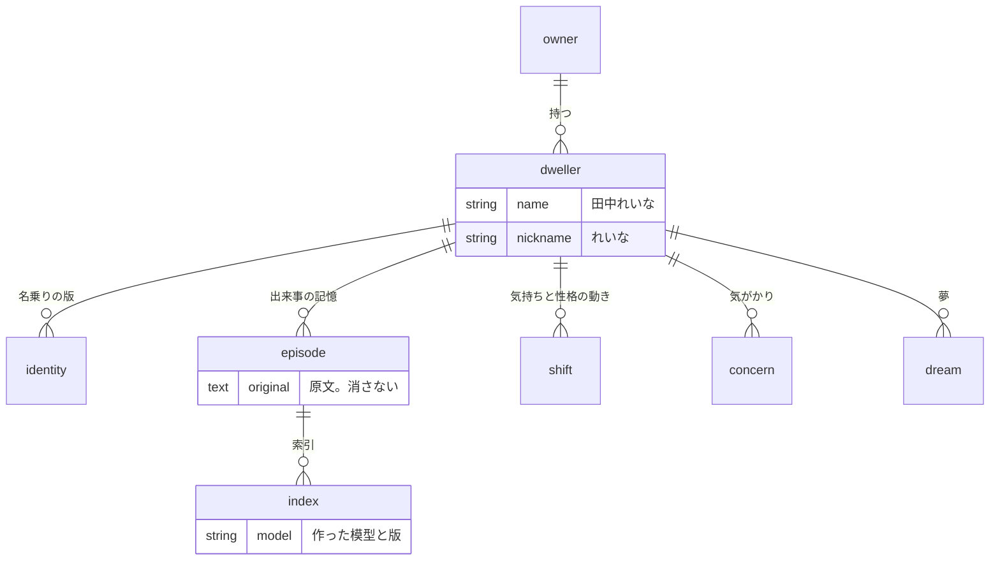

# 全体構造

> [!NOTE]
> 端末から話しかけて一往復できるところまで動く。Discord と対話する道具はまだ繋がっていない。気持ち、性格、気がかり、夢は無い。

## 外からの境界



宿りの本体は常駐するひとつのプログラムである。Discord と対話する道具は、その本体が出ていく先として扱う（[ADR-002](../010_decisions/ADR-002-常駐する本体を宿りとし話す場所を出ていく先とする.md)）。

出ていく先は、本体に対して二つの口だけを使う。

| 口 | 渡すもの | 返るもの・起きること |
|---|---|---|
| 思い出す | どの宿りか、話しかけられた文章 | 関係する記憶と、名乗りと、今の状態 |
| 覚える | どの宿りか、話しかけられた文章、返事 | 記憶が増え、気持ちが動き、気がかりが生まれる |

返事の文章を誰が作るかは出ていく先で異なる。Discord では本体が模型を呼ぶ。対話する道具ではその道具が作り、本体は思い出した内容を渡すだけである。この違いはアダプタの中に閉じる。

夢は、話しかけられていない時間に時計をきっかけに動く。会話とは別の入口を持つ。

## 保存する実体

決めた形である。まだ実装していない。



最上位は宿りである。記憶と状態は持ち主ではなく宿りへ結ぶため、一人の持ち主が複数の宿りを持っても混ざらない（[ADR-014](../010_decisions/ADR-014-宿りを名前を持つ最上位の存在とし記憶と状態をそこへ結ぶ.md)）。

索引は原文から作り直せる派生物である（[ADR-006](../010_decisions/ADR-006-会話の原文を正典とし埋め込みを作り直せる索引とする.md)）。気持ちと性格の現在値は保存せず、動きの積み重ねから求める（[ADR-007](../010_decisions/ADR-007-気持ちと性格を上書きせず出来事から求める.md)）。

## 層と依存の向き

```text
infrastructure → adapter → usecase → domain
```

依存は内向き一方向である（[ADR-004](../010_decisions/ADR-004-層の依存を内向きにし内側を機能で割る.md)）。各層の内側は機能で分ける。

| 層 | 責任 | 知ってよいもの |
|---|---|---|
| `domain` | 記憶の概念。何を記憶として持つか。厚い規則（何が薄れ、いつ気がかりになるか）が現れたらここへ置く | 何も知らない。保存と模型の呼び出しは口だけを置く |
| `usecase` | 会話と夢の手順。思い出す、覚える、整理する。順序と前提の規則もここが持つ | `domain` |
| `adapter` | 出ていく先ごとの違い。Discord、対話する道具、保存の実装、模型の実装 | `usecase` と `domain` |
| `infrastructure` | 起動、設定、常駐、HTTPの受付 | すべて |

`just check-deps` がこの向きを検査する。

## 現在できること

| 目的 | 呼び出し |
|---|---|
| 話しかけられた文章から、直近のやりとりと探した記憶と名乗りを取り出す | `Conversation.recall` |
| 一度のやりとりを原文のまま記憶へ加える | `Conversation.remember` |
| 索引を原文から作り直す | `Conversation.rebuild_index` |
| 話しかけられてから覚えるまでを一往復として通す | `Turn.respond_to` |
| 宿りを起こして、端末で話しかけられるのを待つ | `python -m yadori` |
| 思い出す条件を評価セットで測り、条件を変えた差を読む | `python -m yadori measure` |

`Turn` は、宿り自身が話す場所のための手順である。応対の文章を作る相手を口として受け取る。対話する道具では `Turn` を使わず、`recall` と `remember` を別の時点で呼ぶ。

プロセスの入口は `yadori.infrastructure.start.Startup` である。設定を読み、記憶を開き、宿りを住まわせ、一往復の手順を組み、話す場所へ繋ぐところまでを持つ。設定と記憶と名乗りは `YADORI_HOME`（既定は `~/.yadori`）に置く。リポジトリへは入れない。

| 置くもの | 中身 |
|---|---|
| `dweller.toml` | 名前、呼び名、持ち主、どの模型で考えるか |
| `identity.md` | その宿りが誰であるかを、項目に分けず一続きの文章で書いたもの |
| `memories.sqlite` | 原文、索引、名乗りの版、思い出した記録 |

起動のたびに `identity.md` を読み、内容が変わっていれば新しい版を足す。以前の版は消さない。

評価セットは二つに分ける。リポジトリの `evals/recall.toml` は架空の会話で作り、誰でも回せる。実際の会話から作ったものは `YADORI_HOME` へ置き、`--eval` で指す（[ADR-010](../010_decisions/ADR-010-思い出す質を評価セットで判定する.md)）。

これらの名前は ASCII である。機械が固定の文字列で探し、利用者が端末で打つためである。文書のファイル名は日本語でよい。

記憶は手元のファイル一つ（SQLite）に持つ。原文と索引は別の表に置き、索引を消しても原文は残る。

応対の文章は、手元の対話する道具（Claude Code）を通して作る。持ち主の定額契約で動かすためである（[ADR-016](../010_decisions/ADR-016-応対は対話する道具を通して作り、その道具の文脈を持ち込まない.md)）。その道具が普段持ち込む文脈は外して呼ぶ。`ANTHROPIC_API_KEY` を設定すると従量課金になるため、設定しない。

埋め込みは、意味を見る模型を手元で動かす（`paraphrase-multilingual-MiniLM-L12-v2`、約0.2GB）。提供元への鍵は要らず、初回に模型を取得するときだけ外へ繋ぐ。語の重なりだけを見る実装も残してあり、`measure --embedding characters` で比べられる。

索引は作った模型の名前を持ち、いまの模型で作ったものだけを使う。模型を替えると、起動時にいまの模型の索引が無い記憶へ索引を作り直す。原文は失われない。

## まだ決めていないこと

模型の提供元、Discord と対話する道具への出ていく先、常駐と受付の仕組みは、対応する受入基準を選んだ増分で決める（[ADR-003](../010_decisions/ADR-003-立ち上げで決める技術を三つに限る.md)）。
