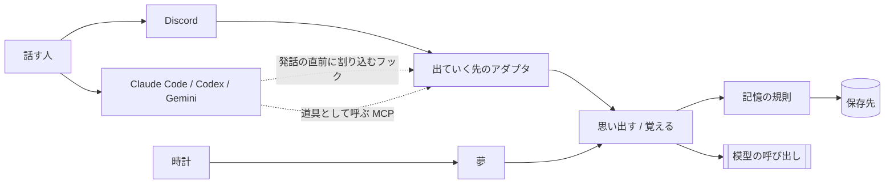
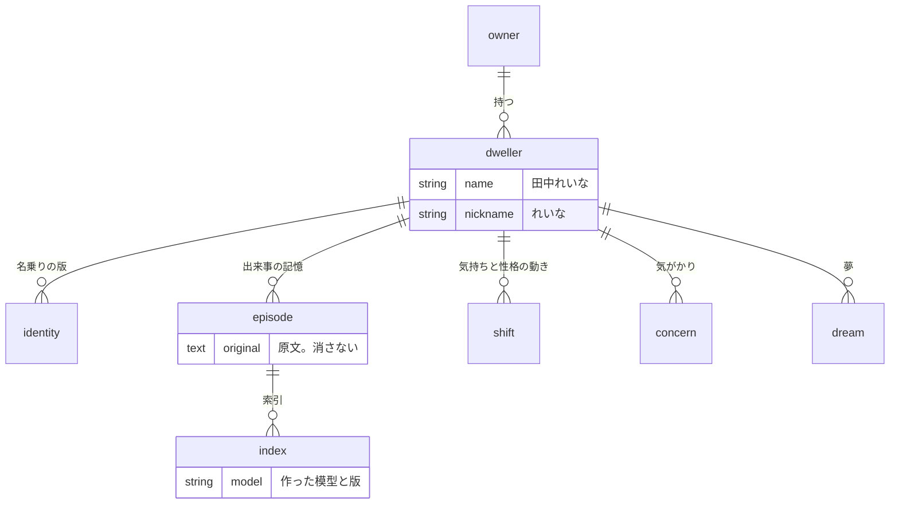

# 全体構造

> [!NOTE]
> 立ち上げの段階である。ここに書いた層と口は決まっているが、機能はまだ実装していない。現在あるのは層のディレクトリと、依存の向きを検査する仕組みだけである。

## 外からの境界



宿りの本体は常駐するひとつのプログラムである。Discord と対話する道具は、その本体が出ていく先として扱う（[ADR-002](../010_decisions/ADR-002-常駐する本体を宿りとし話す場所を出ていく先とする.md)）。

出ていく先は、本体に対して二つの口だけを使う。

| 口 | 渡すもの | 返るもの・起きること |
|---|---|---|
| 思い出す | どの宿りか、話しかけられた文章 | 関係する記憶と、名乗りと、今の状態 |
| 覚える | どの宿りか、話しかけられた文章、返事 | 記憶が増え、気持ちが動き、気がかりが生まれる |

返事の文章を誰が作るかは出ていく先で異なる。Discord では本体が模型を呼ぶ。対話する道具ではその道具が作り、本体は思い出した内容を渡すだけである。この違いはアダプタの中に閉じる。

夢は、話しかけられていない時間に時計をきっかけに動く。会話とは別の入口を持つ。

## 保存する実体

決めた形である。まだ実装していない。



最上位は宿りである。記憶と状態は持ち主ではなく宿りへ結ぶため、一人の持ち主が複数の宿りを持っても混ざらない（[ADR-014](../010_decisions/ADR-014-宿りを名前を持つ最上位の存在とし記憶と状態をそこへ結ぶ.md)）。

索引は原文から作り直せる派生物である（[ADR-006](../010_decisions/ADR-006-会話の原文を正典とし埋め込みを作り直せる索引とする.md)）。気持ちと性格の現在値は保存せず、動きの積み重ねから求める（[ADR-007](../010_decisions/ADR-007-気持ちと性格を上書きせず出来事から求める.md)）。

## 層と依存の向き

```text
infrastructure → adapter → usecase → domain
```

依存は内向き一方向である（[ADR-004](../010_decisions/ADR-004-層の依存を内向きにし内側を機能で割る.md)）。各層の内側は機能で分ける。

| 層 | 責任 | 知ってよいもの |
|---|---|---|
| `domain` | 記憶の規則。何が薄れ、何が残り、いつ気がかりになるか | 何も知らない。保存と模型の呼び出しは口だけを置く |
| `usecase` | 会話と夢の手順。思い出す、覚える、整理する | `domain` |
| `adapter` | 出ていく先ごとの違い。Discord、対話する道具、保存の実装、模型の実装 | `usecase` と `domain` |
| `infrastructure` | 起動、設定、常駐、HTTPの受付 | すべて |

`just check-deps` がこの向きを検査する。

## まだ決めていないこと

模型の提供元、埋め込みの作り方、ベクトル検索の実装、Discord 以外の出ていく先の実装は、対応する受入基準を選んだ増分で決める（[ADR-003](../010_decisions/ADR-003-立ち上げで決める技術を三つに限る.md)）。
